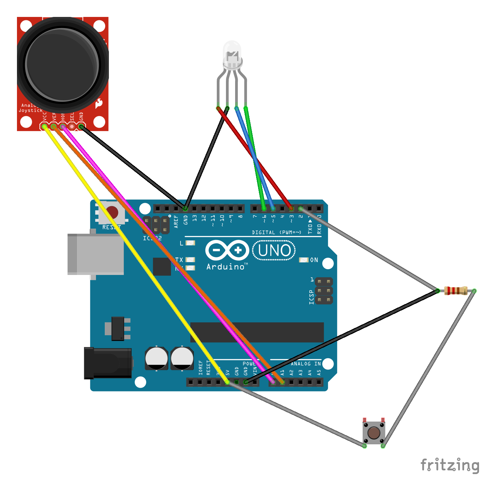

# Projet Gamepad Diva

## Présentation

Le projet proposé ici est une reproduction du jeu [Project Diva](https://fr.wikipedia.org/wiki/Hatsune_Miku:_Project_DIVA), un jeu de rythme édité par Sega. L'objectif est de valider des cibles qui défilent sur l'écran, en suivant le rythme imposé par une musique.

**ajouter capture d'écran représentative du jeu**

## Installation

**à vérifier**

1. Se rendre dans un répertoire quelconque
2. Cloner le projet hébergé sur GitHub :  
`git clone https://github.com/m2iwocsdiva/gamepadDIVA.git`
3. Se rendre dans le répertoire *gamepadDIVA* ainsi créé
4. Construire l'image Docker en utilisant le fichier Dockerfile :  
`docker build .`
5. Lancer l'image Docker :  
`docker run`

## Schéma électronique

Ce jeu peut être utilisé avec les composants suivants, qui doivent être reliés selon le schéma présenté ci-dessous :
* une carte Arduino
* un joystick
* une LED RGB (à 4 broches)
* un bouton à activation ponctuelle
* une résistance

## Utilisation

1. Sur la page d'accueil de l'application, cliquer sur le bouton *Jouer*
2. Cliquer sur le bouton *Sélection*
3. Sélectionner une archive au format ZIP contenant un fichier *beatmap.json*, une vidéo (MP4) et une bande sonore (MP3)
4. Attendre la fin de la vérification de l'archive fournie puis cliquer sur le bouton *Commencer*
5. Deux types de cibles défilent dans la bande de jeu. Pour valider une cible, il faut effectuer, au moment où celle-ci atteint la zone de validation située à gauche, l'action correspondant au type de cette cible :
    * **Les ronds** : presser brièvement le bouton
    * **Les flèches** : pousser le joystick dans la direction représentée par la flèche
6. À l'issue de la partie, consulter les résultats sur la page qui s'affiche
7. Cliquer sur le bouton *Retour à l'accueil* pour recommencer

## Groupe

[DAURAT Corentin](https://github.com/coldu)  
[DEON Emilien](https://github.com/emiliendeon)  
[PRED'HOMME Baptiste](https://github.com/BaptistePh)  
[SAUTEREAU Julien](https://github.com/jsautereau)

[M2 iWOCS - Ingénierie du Web, des Objets Communicants et des Systèmes Complexes](https://www.univ-lehavre.fr/spip.php?formation22)
